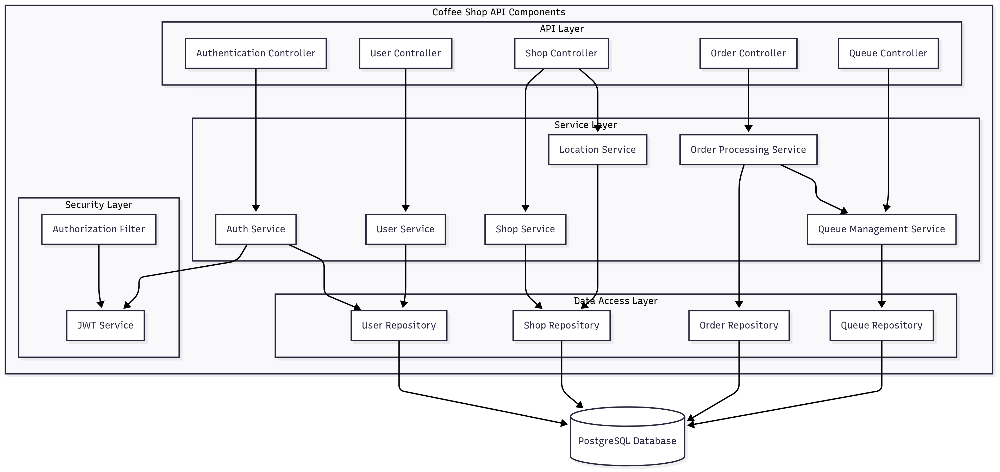

## API Component

This component diagram shows the core services in the Coffee Shop API:
- API Gateway/ALB routes traffic to the Spring Boot application.
- Spring Boot exposes REST controllers, services, and repositories.
- PostgreSQL (with PostGIS) stores relational and geospatial data.
- JWT-based Security guards protected endpoints.
- OpenAPI/Swagger provides API documentation; Actuator exposes health.
- CloudWatch captures logs and metrics for observability.