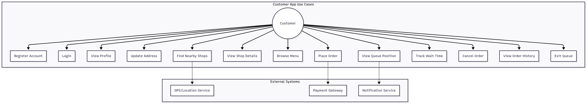

Primary customer journeys:
- Discover: Find nearby shops by location and radius.
- Browse: View shop details and menu (by category).
- Order: Create an order, review items and totals, cancel if needed.
- Queue: Join a shop queue for pickup; check position and ETA.
- Auth: Register/login to obtain JWT for protected operations.