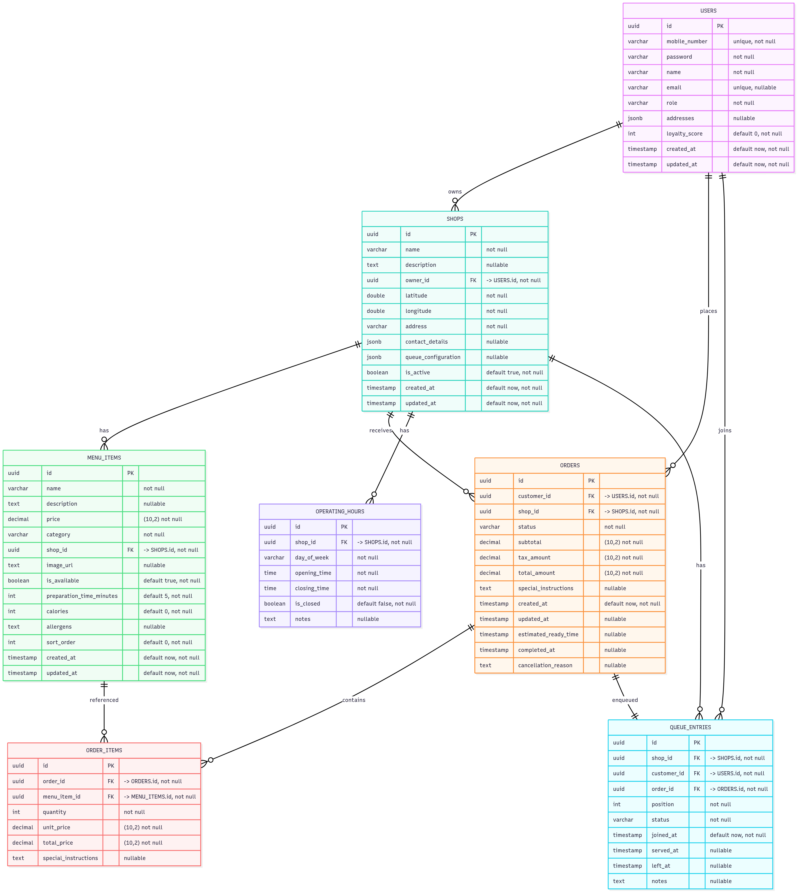

## Database schema

The schema models core domain entities and relationships:
- `users` holds system users with roles: CUSTOMER, OWNER, ADMIN.
- `shops` belongs to a `user` (owner); includes geospatial fields `latitude`, `longitude` and JSONB configs.
- `menu_items` belongs to a `shop`; includes pricing and categorization.
- `orders` belongs to a `customer` and a `shop`; contains totals and status lifecycle.
- `order_items` belongs to an `order` and a `menu_item`; captures quantity and prices.
- `queue_entries` links a `customer`, `shop`, and `order`; tracks position and status.

Indexes exist on frequently queried fields (owner, location, status, timestamps) to optimize reads.