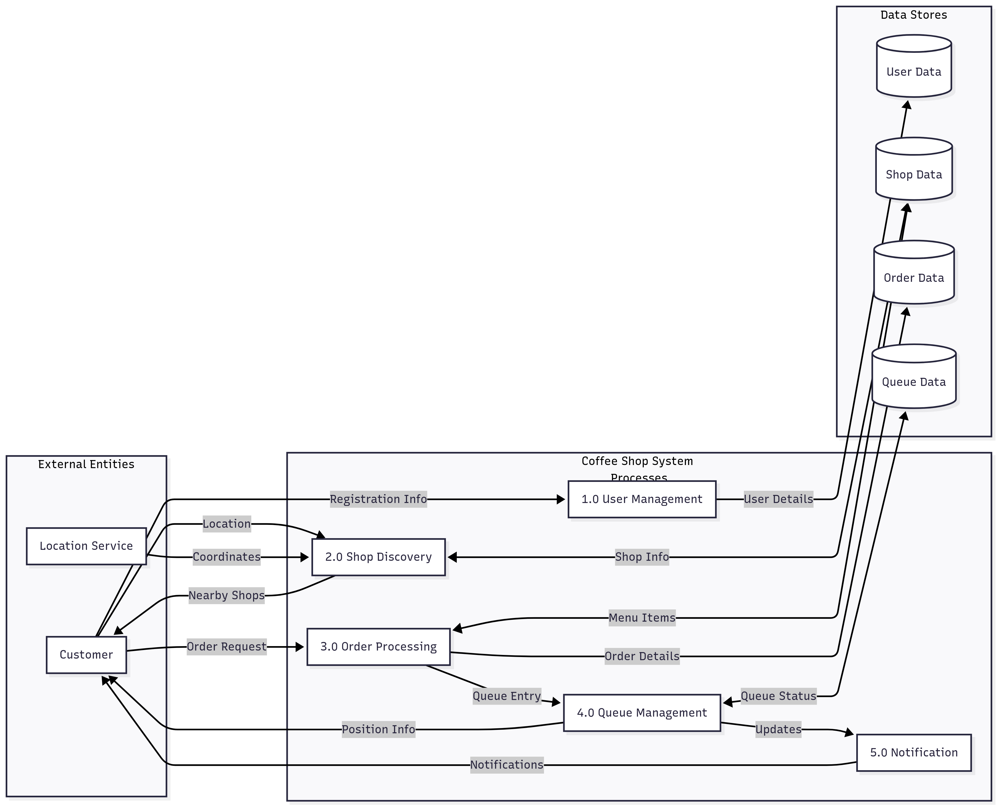

Request flow overview:
- Client calls REST endpoints via ALB → Spring Boot controllers.
- Controllers validate DTOs and invoke services.
- Services perform business logic, persistence via repositories (JPA) and transactions.
- Security Filter (JWT) authenticates requests and sets user context.
- Responses return DTOs; errors are handled by global exception handlers.
- Logs/metrics are emitted to CloudWatch; health via Actuator.