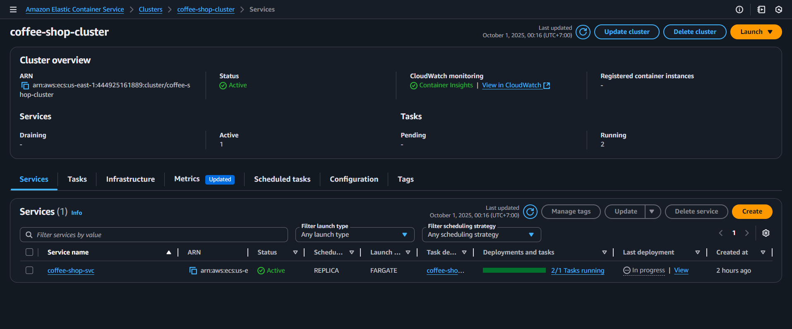
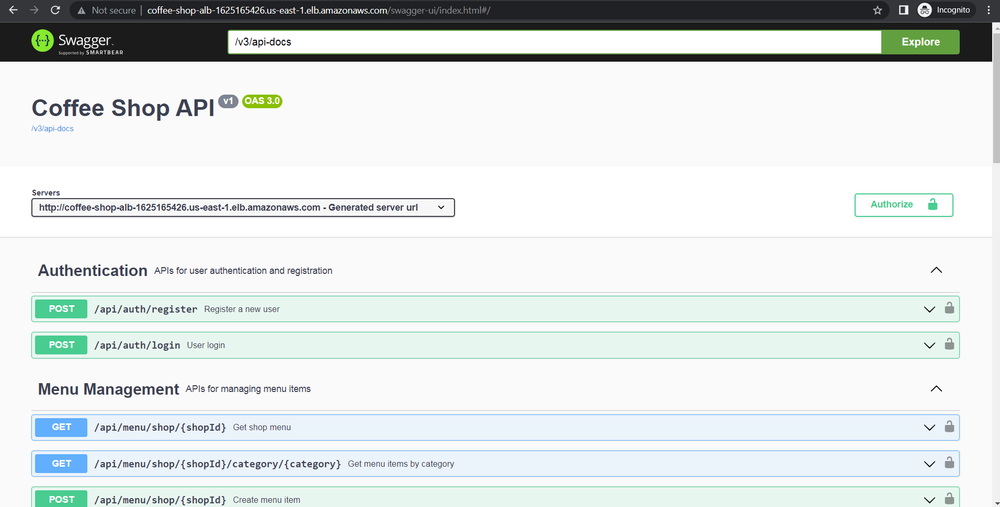

## ECS Task

ECS task running in the cluster with desired count, healthy status, and logs configured to CloudWatch.

## App Swagger

Swagger UI is accessible; the Authorize button supports Bearer JWT to try protected endpoints.
