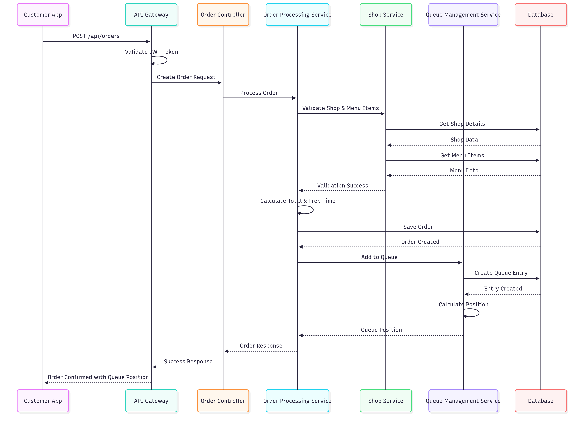
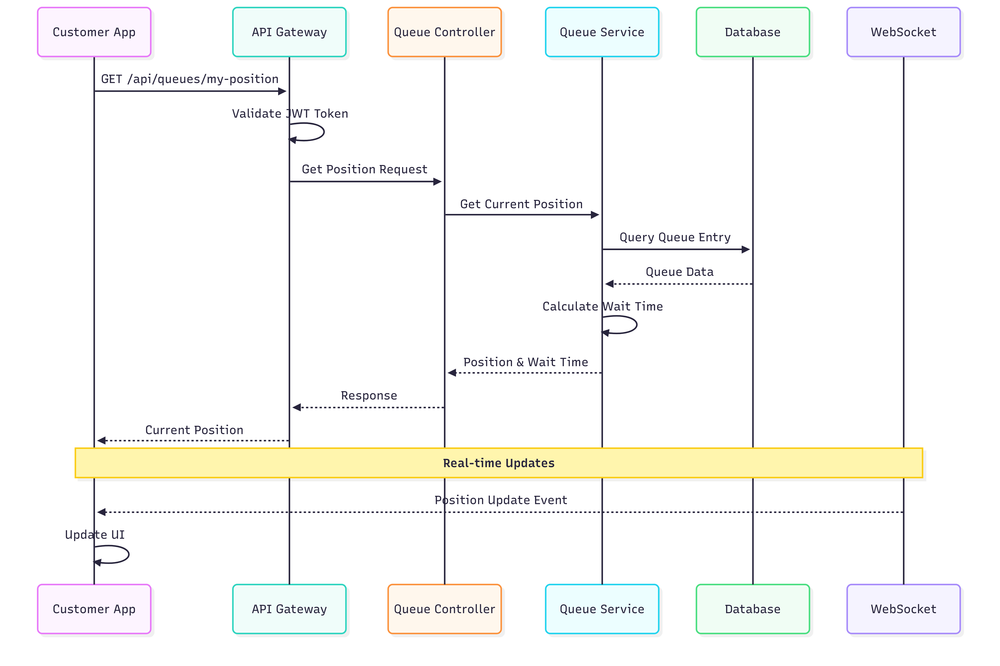

## Customer Registration

- User submits registration → Auth service validates and persists user.
- System returns JWT on successful login.

## Place Order Flow

- Customer selects shop and menu items → Order service validates items and prices.
- Order is saved with items; totals calculated using BigDecimal.
- Optional: Join queue for pickup.

## Check Queue

- Customer requests queue position → Queue service computes position and ETA.
- Response includes position and estimated wait based on service time settings.