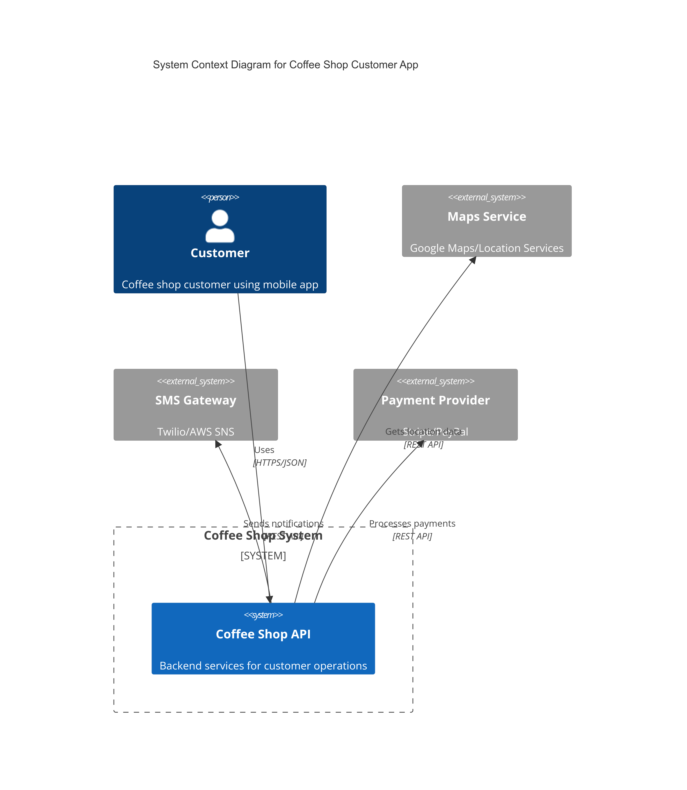

Context and boundaries:
- External actors: Customers and Shop Owners interact via HTTP clients (Swagger, scripts, future frontend).
- AWS infrastructure: ALB, ECS Fargate, ECR, RDS (PostgreSQL), CloudWatch.
- Persistence: RDS for relational data; PostGIS functions for geospatial queries.
- Observability: Actuator endpoints and CloudWatch logs/metrics.
- Security: JWT auth, roles-based access, TLS on ALB (prod/staging).